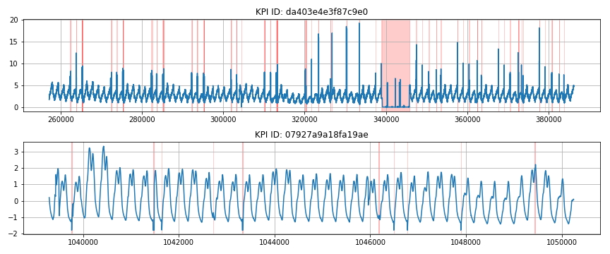

# AIOps Anomaly Detection 🤖
This repository contains an approach to Tsinghua University's AIOps challenge in fall semester 2018. The goal was to identify anomalies among 26 different key performance indicators (KPIs).


*Figure: Trends of two distinct KPIs with highlighted anomalies*

## Prerequisites
* Python >= 3.6
* Pytorch >= 0.4

## Data preprocessing
Temporal KPI data is cleaned, resampled and augmented using the `preprocess.py` script.

```
python preprocess.py <source> <destination>
```

## Training
Train the model by calling the `train.py` script. You should take a look at its content first and select the appropriate model from the `models` submodule. Available models are `ConvModel`, `FullyConnected` and `Inception`. Hyperparameters can also be changed in this file.

## Submission
Take a look at the `submit.py` script if you need to run a prediction pass against a test dataset.
